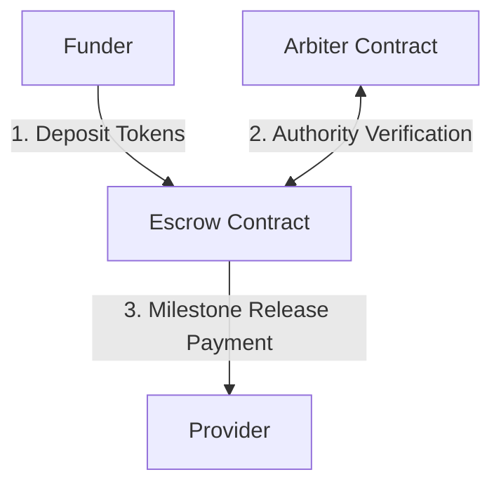

# Tranche — Milestone-Based Escrow Vault

Tranche is a highly secure, milestone-based escrow smart contract architecture on the Stellar Soroban network. It allows a funder to lock a token balance for a provider, which is released in incremental tranches only when an explicit inter-contract call verifies authorization from an arbiter identity contract.

---

## Verifiable On-Chain Evidence (Stellar Testnet)

All smart contracts have been deployed and instantiated on the Stellar testnet. Every transaction hash and contract address listed below is real and verifiable on the Stellar Expert explorer:

| Artifact / Action | Value / Link | Description |
| :--- | :--- | :--- |
| **Deployer Address** | [GBGXPRIFPNXXZG2A36TSSK5TKPGPP3PQQ4DSKW7EO4JDNPMEEV7SDI7U](https://stellar.expert/explorer/testnet/account/GBGXPRIFPNXXZG2A36TSSK5TKPGPP3PQQ4DSKW7EO4JDNPMEEV7SDI7U) | Funded keypair used for deploying and instantiating contracts |
| **Arbiter Contract ID** | [CB5NFMSCZMDEGE7S3IYPIZVUPFOM6UA5WZHOXT4ZSIOBGFDJQ5HVZQON](https://stellar.expert/explorer/testnet/contract/CB5NFMSCZMDEGE7S3IYPIZVUPFOM6UA5WZHOXT4ZSIOBGFDJQ5HVZQON) | Stores authorized arbiter identity and handles auth checks |
| **Escrow Contract ID** | [CBKWN6FBT6EV23WFFGWSLWS7VAQHDWYMR643GI4MF5BHPNC7F7DZGYRD](https://stellar.expert/explorer/testnet/contract/CBKWN6FBT6EV23WFFGWSLWS7VAQHDWYMR643GI4MF5BHPNC7F7DZGYRD) | Tracks milestones, locks funder tokens, and routes release calls |
| **Native Asset Contract (SAC)** | [CDLZFC3SYJYDZT7K67VZ75HPJVIEUVNIXF47ZG2FB2RMQQVU2HHGCYSC](https://stellar.expert/explorer/testnet/contract/CDLZFC3SYJYDZT7K67VZ75HPJVIEUVNIXF47ZG2FB2RMQQVU2HHGCYSC) | Stellar Asset Contract wrapper for native XLM |
| **Wasm Upload (Arbiter)** | [ff707ed1b0b08d70b06f68ded1dcf22eb804b1f6e690eee4602308c8594c998f](https://stellar.expert/explorer/testnet/tx/ff707ed1b0b08d70b06f68ded1dcf22eb804b1f6e690eee4602308c8594c998f) | Transaction hash installing the `tranche_arbiter.wasm` binary |
| **Arbiter Deployment** | [42c6c7bf1d6a29b69bd9d84f374ba9e4207491d7aa3e0b560e1ef5130cba999d](https://stellar.expert/explorer/testnet/tx/42c6c7bf1d6a29b69bd9d84f374ba9e4207491d7aa3e0b560e1ef5130cba999d) | Transaction hash creating the Arbiter contract instance |
| **Arbiter Initialization** | [0d5268cf04715270a4b2fab3101eb7d3f308abe17defcac8afb0893b8f756692](https://stellar.expert/explorer/testnet/tx/0d5268cf04715270a4b2fab3101eb7d3f308abe17defcac8afb0893b8f756692) | Transaction hash initializing the arbiter admin authority |
| **Wasm Upload (Escrow)** | [305a9ccc8741d5aa7c801695b43e74b5e6899e002ab91695717da37f8cf77a53](https://stellar.expert/explorer/testnet/tx/305a9ccc8741d5aa7c801695b43e74b5e6899e002ab91695717da37f8cf77a53) | Transaction hash installing the `tranche_escrow.wasm` binary |
| **Escrow Deployment** | [1ce2eaf0c2003f6e7a349f991446fe318c58a8ed5f4309edbef960760bfb0a98](https://stellar.expert/explorer/testnet/tx/1ce2eaf0c2003f6e7a349f991446fe318c58a8ed5f4309edbef960760bfb0a98) | Transaction hash creating the Escrow contract instance |
| **Escrow Instantiation (State Lock)**| [7e6d30fad48b6aa1960fb9af779ec4698596061ebadbc486fc613c24d617aaf4](https://stellar.expert/explorer/testnet/tx/7e6d30fad48b6aa1960fb9af779ec4698596061ebadbc486fc613c24d617aaf4) | Escrow contract `initialize` locking 10 XLM deposits with auth signing |

---

## Technical Architecture

The contract architecture consists of three contracts communicating via cross-contract calls:
1. **Arbiter Contract**: Stores an admin address. When invoked, it reads this value to answer if the requester address matches the admin context.
2. **Escrow Contract**: Acts as the vault custodian. It locks funder tokens in the contract address. Upon milestone release requests, it dynamically invokes the Arbiter contract to verify release authority, and routes payments to the provider.
3. **Stellar Asset Contract**: Standard token interface for transfer authorizations.



## Compilation & Verification

### Prerequisities
- Install Rust and wasm32v1-none compiler target.
- Install Stellar CLI.

### Compilation
```bash
stellar contract build
```

### Unit Tests
A suite of 7 unit tests covering all success, bounds, custom errors, and math scenarios is implemented. Run tests:
```bash
cargo test
```
Result: `7 passed; 0 failed; 0 ignored`
