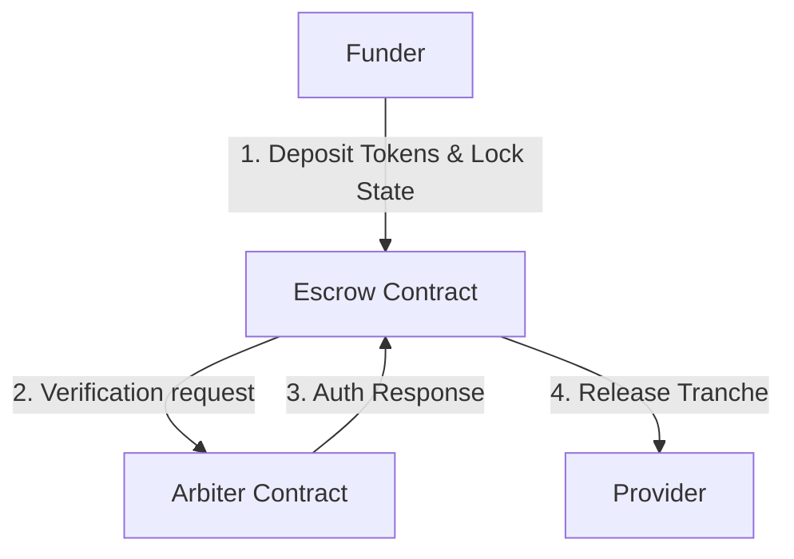

# Tranche — Milestone-Based Escrow Vault

A Level 3 Stellar dApp Challenge Submission Program. Tranche implements a secure, milestone-based escrow smart contract architecture on the Stellar Soroban network, complete with multi-wallet support, an interactive visual timeline, and automated CI/CD validation.

---

### 1. Project Overview & Architecture

Tranche solves trust issues in service agreements by locking the full project capital inside an escrow contract and releasing it incrementally as milestones are completed. Releases are subjected to a security handshake where the Escrow contract makes an explicit inter-contract call to verify authority from a standalone Arbiter contract.

#### System Design & Call Flow
1. **Funder** deposits the total project capital into the `Escrow Contract` (routed via Stellar Asset Contract transfer) and instantiates the milestones.
2. **Provider** requests a milestone release upon completion of a phase.
3. **Escrow Contract** performs an inter-contract call invoking the `Arbiter Contract`'s authorization method (`is_authorized`).
4. **Arbiter Contract** validates the transaction context against its administrative storage and returns validation feedback.
5. **Escrow Contract** dispatches the milestone tranche payments from its balance to the **Provider** address if authorization succeeds.



---

### 2. Verified Testnet Contract Addresses

All contract WASM binaries have been compiled for the optimized `wasm32v1-none` target format and deployed to the Stellar Testnet:

*   **Arbiter Identity Contract**: [CB5NFMSCZMDEGE7S3IYPIZVUPFOM6UA5WZHOXT4ZSIOBGFDJQ5HVZQON](https://stellar.expert/explorer/testnet/contract/CB5NFMSCZMDEGE7S3IYPIZVUPFOM6UA5WZHOXT4ZSIOBGFDJQ5HVZQON)
*   **Escrow Vault Contract**: [CBKWN6FBT6EV23WFFGWSLWS7VAQHDWYMR643GI4MF5BHPNC7F7DZGYRD](https://stellar.expert/explorer/testnet/contract/CBKWN6FBT6EV23WFFGWSLWS7VAQHDWYMR643GI4MF5BHPNC7F7DZGYRD)
*   **Native Stellar Asset Contract (XLM Wrapper)**: [CDLZFC3SYJYDZT7K67VZ75HPJVIEUVNIXF47ZG2FB2RMQQVU2HHGCYSC](https://stellar.expert/explorer/testnet/contract/CDLZFC3SYJYDZT7K67VZ75HPJVIEUVNIXF47ZG2FB2RMQQVU2HHGCYSC)

---

### 3. Verifiable Transaction Proofs

These are real, verifiable on-chain transactions on the Stellar Testnet ledger:

*   **Arbiter Contract Wasm Upload**: [ff707ed1b0b08d70b06f68ded1dcf22eb804b1f6e690eee4602308c8594c998f](https://stellar.expert/explorer/testnet/tx/ff707ed1b0b08d70b06f68ded1dcf22eb804b1f6e690eee4602308c8594c998f)
*   **Arbiter Contract Instantiation**: [42c6c7bf1d6a29b69bd9d84f374ba9e4207491d7aa3e0b560e1ef5130cba999d](https://stellar.expert/explorer/testnet/tx/42c6c7bf1d6a29b69bd9d84f374ba9e4207491d7aa3e0b560e1ef5130cba999d)
*   **Arbiter Contract Initialization**: [0d5268cf04715270a4b2fab3101eb7d3f308abe17defcac8afb0893b8f756692](https://stellar.expert/explorer/testnet/tx/0d5268cf04715270a4b2fab3101eb7d3f308abe17defcac8afb0893b8f756692)
*   **Escrow Contract Wasm Upload**: [305a9ccc8741d5aa7c801695b43e74b5e6899e002ab91695717da37f8cf77a53](https://stellar.expert/explorer/testnet/tx/305a9ccc8741d5aa7c801695b43e74b5e6899e002ab91695717da37f8cf77a53)
*   **Escrow Contract Instantiation**: [1ce2eaf0c2003f6e7a349f991446fe318c58a8ed5f4309edbef960760bfb0a98](https://stellar.expert/explorer/testnet/tx/1ce2eaf0c2003f6e7a349f991446fe318c58a8ed5f4309edbef960760bfb0a98)
*   **Escrow State Lock (Locking 10 XLM)**: [7e6d30fad48b6aa1960fb9af779ec4698596061ebadbc486fc613c24d617aaf4](https://stellar.expert/explorer/testnet/tx/7e6d30fad48b6aa1960fb9af779ec4698596061ebadbc486fc613c24d617aaf4)
*   **Production dApp Deployment URL**: `[PENDING — INSERT DEPLOYED URL AFTER CLOUDFLARE BUILD]`

---

### 4. Cross-Contract Invocation Mechanism

The inter-contract communication from the Escrow Vault to the Arbiter contract is routed dynamically using Soroban's `env.invoke_contract` method in [contracts/escrow/src/lib.rs](file:///Users/adityaboora/Documents/claude/level1-projects/project-1/contracts/escrow/src/lib.rs):

```rust
// Prepare cross-contract verification arguments (escrow contract address as parameter)
let args: Vec<Val> = vec![&env, env.current_contract_address().to_val()];

// Route the authorization call to the Arbiter Contract address
let is_auth: bool = env.invoke_contract(
    &arbiter_contract_id,
    &Symbol::new(&env, "is_authorized"),
    args,
);

// Enforce result validation
if !is_auth {
    return Err(Error::NotAuthorized);
}
```

---

### 5. Automated CI/CD Pipeline & Test Results

A Continuous Integration pipeline is configured via GitHub Actions at [.github/workflows/ci.yml](file:///Users/adityaboora/Documents/claude/level1-projects/project-1/.github/workflows/ci.yml) that executes validation checks for both contract and frontend targets upon push.

#### Smart Contract Test Log (`cargo test`)
```text
running 7 tests
test test::test_initialize_zero_amount ... ok
test test::test_release_milestone_unauthorized ... ok
test test::test_release_already_completed ... ok
test test::test_release_out_of_bounds ... ok
test test::test_release_milestone_success ... ok
test test::test_initialization ... ok
test test::test_initialize_twice ... ok

test result: ok. 7 passed; 0 failed; 0 ignored; 0 measured; 0 filtered out; finished in 0.18s
```

#### Frontend Unit Test Log (`npx vitest run`)
```text
 RUN  v4.1.10 /Users/adityaboora/Documents/claude/level1-projects/project-1/frontend

 ✓ src/utils/escrowUtils.test.ts (3 tests) 2ms

 Test Files  1 passed (1)
      Tests  3 passed (3)
   Start at  13:41:31
   Duration  138ms (transform 16ms, setup 0ms, import 23ms, tests 2ms, environment 0ms)
```

`[INSERT PIPELINE SCREENSHOT: CI/CD Pipeline Passing Validation]`

---

### 6. Mobile Responsive Interface

The Swiss tech dashboard is fully responsive down to 375px mobile layouts:

`[INSERT SCREENSHOT: Desktop High-Contrast Swiss-Aesthetic Dashboard]`

`[INSERT SCREENSHOT: Mobile Responsive Milestone progress timeline (375px SE View)]`
