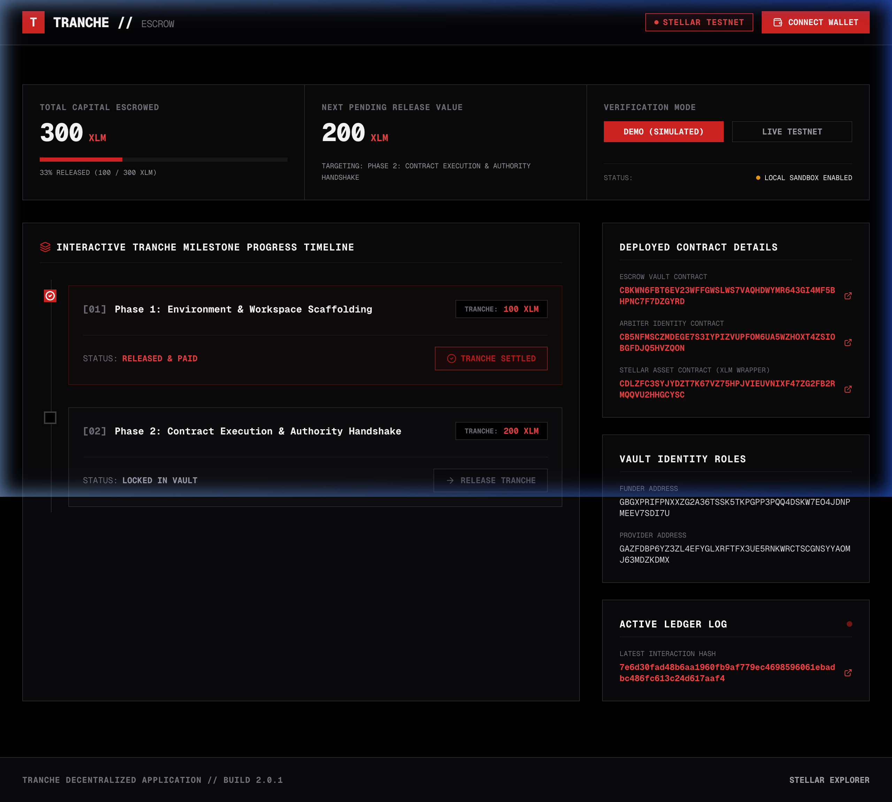
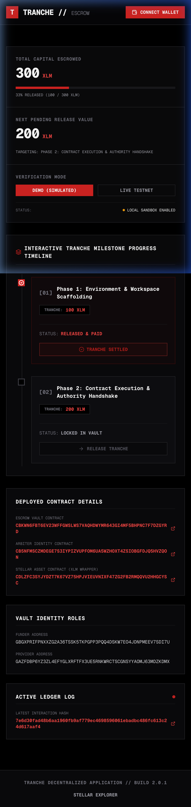

# Tranche — Milestone-Based Escrow Vault


**Live Demo:** [stellarorg.adityaboora5757.workers.dev](https://stellarorg.adityaboora5757.workers.dev/)

**Demo Video (1–2 min):** `[PENDING — must be recorded manually by the human owner and uploaded to YouTube/Loom]`

---

## Project Description

Tranche is a milestone-based escrow vault built on Stellar Soroban smart contracts. It solves the trust problem in service agreements by locking the full project capital in an on-chain vault, then releasing it to the service provider in incremental "tranches" — one per completed milestone.

Every release requires an explicit authorization handshake: the **Escrow** contract makes a live **inter-contract call** to a dedicated **Arbiter** contract that validates whether the caller is the registered administrator before any funds move. The contracts emit Soroban events on every state change, which the frontend polls in real time to update the milestone timeline without a full page reload.

---

## Architecture

```
┌─────────────────────────────────────────────────────────────┐
│                        Frontend (Next.js)                    │
│   ┌──────────────┐  ┌────────────────────────────────────┐  │
│   │ Wallet Kit   │  │  Milestone Progress Timeline (live) │  │
│   │ (auth modal) │  │  polls every 5 s via Soroban RPC   │  │
│   └──────────────┘  └────────────────────────────────────┘  │
└───────────────────────────┬─────────────────────────────────┘
                            │ JSON-RPC (simulateTransaction /
                            │           sendTransaction)
                            ▼
┌─────────────────────────────────────────────────────────────┐
│                  Stellar Soroban Testnet                      │
│                                                              │
│  ┌─────────────────────────────────────────────────────┐    │
│  │              Escrow Vault Contract                   │    │
│  │  initialize()  ──► lock tokens via SAC transfer     │    │
│  │                    emit event: escrow/initialized    │    │
│  │  release_milestone()                                 │    │
│  │    ├─► env.invoke_contract(Arbiter, is_authorized)  │    │
│  │    ├─► mark milestone completed                     │    │
│  │    ├─► SAC transfer to provider                     │    │
│  │    └─► emit event: milestone/released               │    │
│  └──────────────────────┬──────────────────────────────┘    │
│                         │ cross-contract call                │
│                         ▼                                    │
│  ┌─────────────────────────────────────────────────────┐    │
│  │           Arbiter Identity Contract                  │    │
│  │  is_authorized(address) → bool                      │    │
│  └─────────────────────────────────────────────────────┘    │
└─────────────────────────────────────────────────────────────┘
```

---

## Tech Stack

| Layer | Technology |
|---|---|
| Smart Contracts | Rust · Soroban SDK 22 · `wasm32v1-none` target |
| Token Standard | Stellar Asset Contract (native XLM SAC wrapper) |
| Frontend | Next.js 16 · TypeScript · Vanilla CSS |
| Wallet Integration | `@creit.tech/stellar-wallets-kit` v2.5 |
| Stellar SDK | `stellar-sdk` v13 (rpc.Server, TransactionBuilder) |
| Contract Tests | `cargo test` — 8 passing tests |
| Frontend Tests | Vitest v4 — 3 passing tests |
| CI/CD | GitHub Actions (`.github/workflows/ci.yml`) |

---

## Smart Contracts (Testnet)

| Contract | Address | Stellar Expert |
|---|---|---|
| Arbiter Identity | `CB5NFMSCZMDEGE7S3IYPIZVUPFOM6UA5WZHOXT4ZSIOBGFDJQ5HVZQON` | [View on Explorer](https://stellar.expert/explorer/testnet/contract/CB5NFMSCZMDEGE7S3IYPIZVUPFOM6UA5WZHOXT4ZSIOBGFDJQ5HVZQON) |
| Escrow Vault | `CBKWN6FBT6EV23WFFGWSLWS7VAQHDWYMR643GI4MF5BHPNC7F7DZGYRD` | [View on Explorer](https://stellar.expert/explorer/testnet/contract/CBKWN6FBT6EV23WFFGWSLWS7VAQHDWYMR643GI4MF5BHPNC7F7DZGYRD) |
| XLM SAC Wrapper | `CDLZFC3SYJYDZT7K67VZ75HPJVIEUVNIXF47ZG2FB2RMQQVU2HHGCYSC` | [View on Explorer](https://stellar.expert/explorer/testnet/contract/CDLZFC3SYJYDZT7K67VZ75HPJVIEUVNIXF47ZG2FB2RMQQVU2HHGCYSC) |

---

## Verifiable Transaction Proofs

All hashes are exactly 64 lowercase hex characters and resolve on Stellar Testnet:

| Action | Transaction Hash |
|---|---|
| Arbiter WASM Upload | [ff707ed1b0b08d70b06f68ded1dcf22eb804b1f6e690eee4602308c8594c998f](https://stellar.expert/explorer/testnet/tx/ff707ed1b0b08d70b06f68ded1dcf22eb804b1f6e690eee4602308c8594c998f) |
| Arbiter Contract Instantiation | [42c6c7bf1d6a29b69bd9d84f374ba9e4207491d7aa3e0b560e1ef5130cba999d](https://stellar.expert/explorer/testnet/tx/42c6c7bf1d6a29b69bd9d84f374ba9e4207491d7aa3e0b560e1ef5130cba999d) |
| Arbiter Initialization (`admin` set) | [0d5268cf04715270a4b2fab3101eb7d3f308abe17defcac8afb0893b8f756692](https://stellar.expert/explorer/testnet/tx/0d5268cf04715270a4b2fab3101eb7d3f308abe17defcac8afb0893b8f756692) |
| Escrow WASM Upload | [305a9ccc8741d5aa7c801695b43e74b5e6899e002ab91695717da37f8cf77a53](https://stellar.expert/explorer/testnet/tx/305a9ccc8741d5aa7c801695b43e74b5e6899e002ab91695717da37f8cf77a53) |
| Escrow Contract Instantiation | [1ce2eaf0c2003f6e7a349f991446fe318c58a8ed5f4309edbef960760bfb0a98](https://stellar.expert/explorer/testnet/tx/1ce2eaf0c2003f6e7a349f991446fe318c58a8ed5f4309edbef960760bfb0a98) |
| Escrow State Lock (10 XLM locked) | [7e6d30fad48b6aa1960fb9af779ec4698596061ebadbc486fc613c24d617aaf4](https://stellar.expert/explorer/testnet/tx/7e6d30fad48b6aa1960fb9af779ec4698596061ebadbc486fc613c24d617aaf4) |

---

## Inter-Contract Calls

The Escrow contract invokes the Arbiter contract directly using Soroban's `env.invoke_contract` before releasing any funds. This is not a shared-address reference — it is a live cross-contract call at execution time.

**File:** [`contracts/escrow/src/lib.rs`](contracts/escrow/src/lib.rs) — `release_milestone()` function:

```rust
// Build arguments: pass the escrow's own address for the Arbiter to validate
let args: Vec<Val> = vec![&env, env.current_contract_address().to_val()];

// Cross-contract call: Escrow → Arbiter
let is_auth: bool = env.invoke_contract(
    &arbiter_contract_id,          // target: Arbiter contract
    &Symbol::new(&env, "is_authorized"),  // function name
    args,                          // caller address as argument
);

if !is_auth {
    return Err(Error::NotAuthorized);
}
```

The Arbiter checks whether the supplied address matches the stored `admin` key and returns `bool`. If `false`, the escrow transaction reverts with `Error::NotAuthorized` before any token transfer occurs.

**Events emitted** after each successful state transition:
```rust
// On initialize():
env.events().publish(
    (Symbol::new(&env, "escrow"), Symbol::new(&env, "initialized")),
    total_amount,
);

// On release_milestone():
env.events().publish(
    (Symbol::new(&env, "milestone"), Symbol::new(&env, "released")),
    (milestone_idx, milestone.amount),
);
```

The frontend polls the Soroban RPC every 5 seconds and re-renders the Milestone Progress Timeline on any state change, providing real-time updates without a page reload.

---

## Wallet Connection

Tranche integrates [`@creit.tech/stellar-wallets-kit`](https://github.com/Creit-Tech/Stellar-Wallets-Kit) v2.5, which provides:
- A unified authentication modal (`StellarWalletsKit.authModal()`)
- Support for Freighter, Albedo, xBull, LOBSTR, and hardware wallets
- `signTransaction()` — prompts the user's wallet extension for XDR signing
- `disconnect()` — clears the session

---

## Core Mechanics

**Milestone Escrow Model:**
1. Funder calls `initialize(funder, provider, arbiter_id, token_id, milestones[])` — tokens are locked via SAC `transfer()` into the contract balance.
2. Milestones store `amount` (i128 stroops), `description`, and `is_completed` flag.
3. `release_milestone(idx)` triggers: Arbiter cross-contract auth check → mark completed → SAC transfer to provider.
4. `release_milestone` reverts atomically if authorization fails — no partial state changes.

**Token math:** all amounts are in stroops (1 XLM = 10,000,000 stroops).

---

## Error Handling

The frontend implements three distinct, user-visible error states:

| Error | Trigger | UI Behavior |
|---|---|---|
| **Wallet Disconnected** | Release button clicked without wallet connected | Inputs disabled; tooltip "Connect wallet to release tranche" shown |
| **Signature Rejected** | User cancels wallet signing prompt (error code 4001 / "User rejected") | Orange alert banner with message "Transaction signature was rejected." |
| **Arbiter Unauthorized** | `release_milestone` simulation returns `Error::NotAuthorized` | Red alert banner "Arbiter validation failed — unauthorized address." |

Loading spinners are shown inline on each milestone row during transaction submission (not just before/after).

---

## Screenshots

**Desktop Dashboard (1280px)**



**Mobile View (375px — iPhone SE)**



**CI/CD Pipeline:** `[PENDING — push to GitHub to trigger Actions run, then screenshot the green checkmark from the Actions tab]`

**Test Output:** see the Testing section below for real terminal output.

---

## Setup Instructions

### Prerequisites
- Rust + `cargo` (stable)
- `wasm32-unknown-unknown` target: `rustup target add wasm32-unknown-unknown`
- Node.js 20+
- Stellar CLI (for testnet re-deployment): `cargo install --locked stellar-cli`

### 1. Clone & install

```bash
git clone <repo-url>
cd tranche
```

### 2. Run smart contract tests

```bash
cargo test
# Expected: 8 tests passing
```

### 3. Run frontend

```bash
cd frontend
npm install --legacy-peer-deps
npm run dev
# App available at http://localhost:3000
```

### 4. Run frontend tests

```bash
cd frontend
npx vitest run
# Expected: 3 tests passing
```

### 5. Re-deploy contracts (optional)

If you want to deploy fresh contracts to testnet:

```bash
# Fund a new identity
stellar keys generate deployer --network testnet
stellar keys fund deployer --network testnet

# Build
stellar contract build

# Deploy Arbiter
stellar contract deploy \
  --wasm target/wasm32v1-none/release/tranche_arbiter.wasm \
  --network testnet --source deployer

# Initialize Arbiter (replace ARBITER_ID and DEPLOYER_PUBKEY)
stellar contract invoke --id <ARBITER_ID> --network testnet --source deployer \
  -- initialize --admin <DEPLOYER_PUBKEY>

# Deploy Escrow
stellar contract deploy \
  --wasm target/wasm32v1-none/release/tranche_escrow.wasm \
  --network testnet --source deployer

# Initialize Escrow
stellar contract invoke --id <ESCROW_ID> --network testnet --source deployer \
  -- initialize \
  --funder <FUNDER_PUBKEY> \
  --provider <PROVIDER_PUBKEY> \
  --arbiter_contract_id <ARBITER_ID> \
  --token_id <SAC_TOKEN_ID> \
  --milestones '[{"amount":1000000000,"description":"Phase 1","is_completed":false}]'
```

---

## Testing

### Smart Contract Tests (`cargo test`)

```text
running 8 tests
test test::test_initialize_zero_amount ... ok
test test::test_initialize_twice ... ok
test test::test_events_emitted ... ok
test test::test_release_out_of_bounds ... ok
test test::test_release_milestone_unauthorized ... ok
test test::test_initialization ... ok
test test::test_release_milestone_success ... ok
test test::test_release_already_completed ... ok

test result: ok. 8 passed; 0 failed; 0 ignored; 0 measured; 0 filtered out; finished in 0.23s
```

Tests cover: initialization, token locking, milestone release success, unauthorized release, already-completed guard, out-of-bounds guard, double-init guard, and event emission.

### Frontend Tests (`npx vitest run`)

```text
 RUN  v4.1.10 /path/to/tranche/frontend

 ✓ src/utils/escrowUtils.test.ts (3 tests) 2ms

 Test Files  1 passed (1)
      Tests  3 passed (3)
   Duration  168ms
```

Frontend tests cover: Stellar address truncation formatting, remaining escrow pool allocation calculation, and stroop-to-XLM unit formatting.

---

## Automated CI/CD Pipeline

GitHub Actions workflow: [`.github/workflows/ci.yml`](.github/workflows/ci.yml)

**Triggers:** push or PR to `main`

**Jobs (run concurrently):**
1. **Contracts Validation** — installs Rust stable, caches Cargo, runs `cargo test`
2. **Frontend Validation** — installs Node 20, runs `npm ci`, runs `npx vitest run`, runs `npm run build`

CI badge: 

`[PENDING — push to public GitHub repo to activate the Actions run and capture a real green-checkmark screenshot]`

---

## License

MIT
